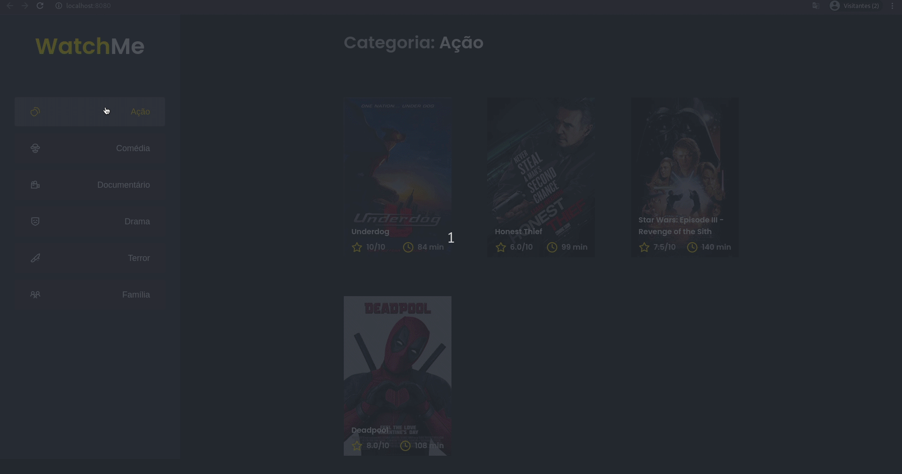

# WatchMe

<h1 align="center">
    
</h1>

## Summary

* [💻 About](#-about)
* [🛠 Main technologies](#-main-technologies)
* [🚀 How to run the project](#-how-to-run-the-project)
* [🦸 Author](#-author)
* [📝 License](#-license)

## 💻 About

An app for practice the learned concepts about foundamentals of ReactJS at Rocketseat Ignite

## 🛠 Main technologies

-   **[React](https://reactjs.org/)**
-   **[Typescript](https://www.typescriptlang.org/)**
-   **[Json Server](https://github.com/typicode/json-server)**
-   **[Axios](https://axios-http.com/)**
-   **[Babel](https://babeljs.io/)**
-   **[Webpack](https://webpack.js.org/)**
-   **[Sass](https://sass-lang.com/)**

>(You can see all the dependencies in the [package.json](./package.json) file)

## 🚀 How to run the project

You need to have the following tools installed before clone and run project: [Git](https://git-scm.com), [Node.js](https://nodejs.org/en/).

```bash
# Clone this repository
$ git clone https://github.com/alissonmarqui/ignite-react-watch-me.git

# Access the project folder
$ cd ignite-react-watch-me

# Install the dependencies
$ yarn || npm install

# Run the fake api with json-server
$ yarn server || npm run server

# Run the application in dev mode
$ yarn dev || npm run dev
```
After that open your browser and access: http://localhost:8080/

## 🦸 Author

<a href="https://app.rocketseat.com.br/me/alissonmarqui">
   
   <br/>
   <sub><b>Alisson de Marqui</b></sub>   
</a>
<br/>

[](https://www.linkedin.com/in/alissonmarqui/) 
[](mailto:alissonmarqui@gmail.com)

## 📝 License

This project are under the [MIT license.](./LICENSE)
